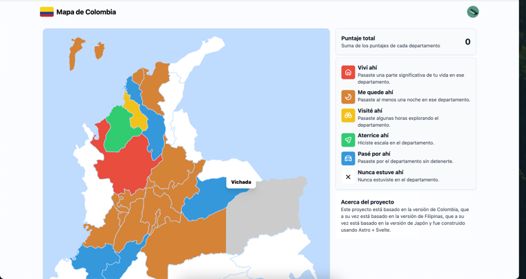

## Colombian Map

Colombian map where you can fill with th departments that you have.



1. **Clone the repository:**

   ```bash
   git clone https://github.com/Porter-smith/astro-firebase-svelte-tailwind-starter.git
   ```

2. **Navigate to the project directory:**

   ```bash
   cd astro-firebase-svelte-tailwind-starter
   ```

3. **Install the dependencies:**

   ```bash
   pnpm install
   ```

4. **Start the development server:**

   ```bash
   pnpm run dev
   ```

# Quickstart

Follow this guide to quickly set up Firebase for your project. For more in-depth instructions,
see [FIREBASE_SETUP.md](./docs/FIREBASE_SETUP.md).

## Obtain Firebase Keys

### Service Account Key

1. Go to the [Firebase Console](https://console.firebase.google.com/).
2. Navigate to `Project settings` > `Service accounts`.
3. Click `Generate new private key`, then download and secure the JSON file.

### Web App Configuration

1. If you haven't added a web app to [Firebase](https://console.firebase.google.com/), click the web icon (`</>`)
   in `Project settings` > `Your apps` to create one.
2. Find your web app and you should see your `configuration`
3. Copy the configuration object.

## Update Configuration Files

Place your keys in the appropriate files:

- `.env`: Add service account key values from the downloaded JSON.
- `src/firebase/client.ts`: Insert the web app configuration object.

### Set up .env with Helper Script

To configure your environment variables quickly:

Save your service account creds as `service-account.json` in the project's root.
Run

```bash
 node scripts/createEnvFromServiceAccount.js
```

A .env file with all Firebase variables will be generated. So you don't have to copy and paste one by one each key.

**Note:** After setting up the .env file, remember to remove the service-account.json from your project's root directory
to protect your credentials.

## Enable Authentication

### Configure Auth Methods

1. In [Firebase Console](https://console.firebase.google.com/), go to `Authentication`.
2. Click `Get started`.
3. Enable your desired sign-in methods and configure each according to Firebase's prompts.

## Ready to Go

You should now be able to run your application and use Firebase's authentication services.

🚀 Happy coding!
