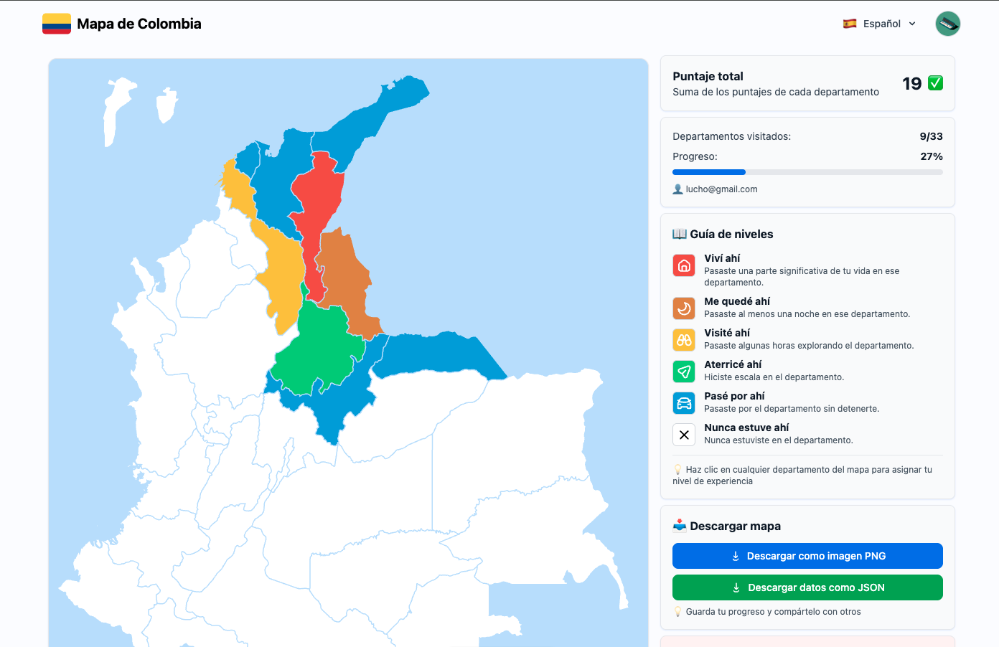

# Colombian Travel Level Map 🇨🇴

Interactive map of Colombia where you can track your travel experiences by department. Mark each department with different levels based on your travel status - from planning to visit to having lived there.



## 🌍 About This Project

This project is based on a series of travel level maps from different countries:

- **Original inspiration**: [Japan Travel Level Map](https://zhung.com.tw/japanex/) by zhung.com.tw
- **Philippines version**: [Philippines Travel Level Map](https://github.com/OSSPhilippines/philippines-travel-level-map) by OSSPhilippines
- **Colombia SVG data**: [Colombia Map Data](https://github.com/aumentada/colombia) by aumentada

This Colombian adaptation builds upon these excellent projects, adapting the concept for Colombia's 32 departments and Bogotá D.C.

## 🎨 Travel Levels

Each department can be marked with one of six travel levels:

- **Nunca estuviste** (White) - Never been there
- **Pasaste por ahí** (Blue) - Passed through
- **Aterrizaste ahí** (Green) - Landed there
- **Visitaste ahí** (Yellow) - Visited there
- **Te quedaste ahí** (Orange) - Stayed there
- **Viviste ahí** (Red) - Lived there

## 🚀 Quick Start

1. **Clone the repository:**
   ```bash
   git clone https://github.com/yourusername/colombia-travel-level-map.git
   ```

2. **Navigate to the project directory:**
   ```bash
   cd colombia-travel-level-map
   ```

3. **Install dependencies:**
   ```bash
   pnpm install
   ```

4. **Set up Firebase (see setup section below)**

5. **Start the development server:**
   ```bash
   pnpm run dev
   ```

## 🔧 Tech Stack

- **Frontend**: Astro + Svelte + TypeScript
- **Styling**: Tailwind CSS
- **Authentication**: Firebase Auth
- **Database**: Firestore
- **Package Manager**: pnpm

## 🔥 Firebase Setup

Follow this guide to quickly set up Firebase for your project. For more detailed instructions, see [FIREBASE_SETUP.md](./docs/FIREBASE_SETUP.md).

### Obtain Firebase Keys

#### Service Account Key
1. Go to the [Firebase Console](https://console.firebase.google.com/)
2. Navigate to `Project settings` > `Service accounts`
3. Click `Generate new private key`, then download and secure the JSON file

#### Web App Configuration
1. If you haven't added a web app to Firebase, click the web icon (`</>`) in `Project settings` > `Your apps` to create one
2. Find your web app and copy the configuration object

### Quick Setup with Helper Script

1. Save your service account credentials as `service-account.json` in the project's root
2. Run the helper script:
   ```bash
   node scripts/createEnvFromServiceAccount.js
   ```
3. Update `src/firebase/client.ts` with your web app configuration
4. **Important**: Remove `service-account.json` after setup to protect your credentials

### Enable Authentication

1. In Firebase Console, go to `Authentication`
2. Click `Get started`
3. Enable Google sign-in and configure according to Firebase's prompts

## 🎯 Features

- Interactive map of all Colombian departments
- User authentication with Google
- Personal travel level tracking
- Data persistence with Firestore
- Responsive design
- Map export functionality
- Multi-language support

## 🛠️ Development

### Available Scripts

- `pnpm dev` - Start development server
- `pnpm build` - Build for production
- `pnpm preview` - Preview production build
- `pnpm test` - Run tests
- `pnpm lint` - Run linter

### Project Structure

```
src/
├── components/          # Svelte components
├── firebase/           # Firebase configuration
├── layouts/            # Astro layouts
├── pages/              # Astro pages
└── css/                # Global styles
```

## 🚀 Future Features

- **Achievement system**: Badges like "Caribbean Explorer", "Andean Expert"
- **User comparisons**: Rankings and statistics
- **Social sharing**: Share your travel map on social media
- **Export options**: SVG, PDF formats
- **Department information**: 
  - Tourist information for each department
  - Representative photos
  - Demographic and economic data
  - Links to official tourism resources

## 📄 License

This project is licensed under the MIT License - see the [LICENSE](LICENSE) file for details.

## 🤝 Contributing

Contributions are welcome! Please feel free to submit a Pull Request.

## 🙏 Acknowledgments

- Original concept by zhung.com.tw
- Philippines adaptation by OSSPhilippines
- Colombia map data by aumentada
- Built with Astro, Svelte, and Firebase
